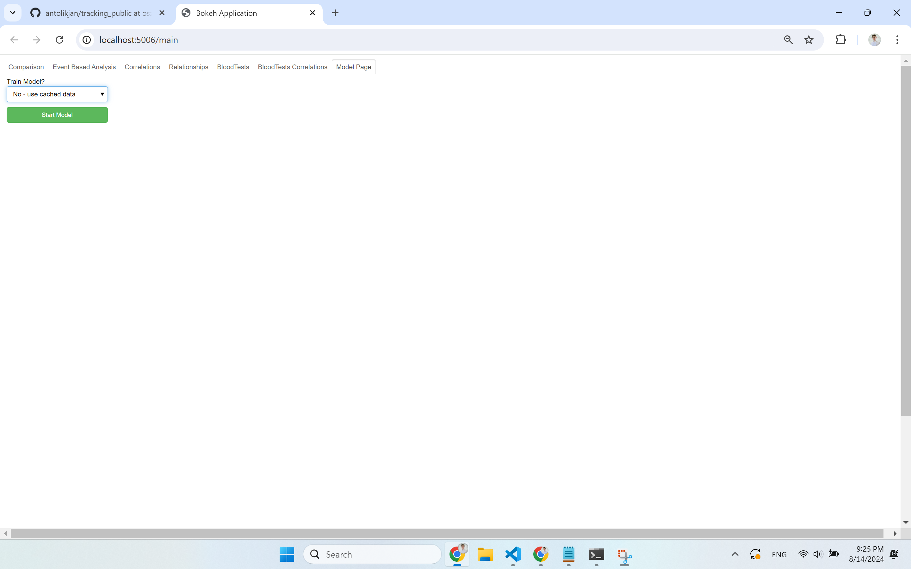
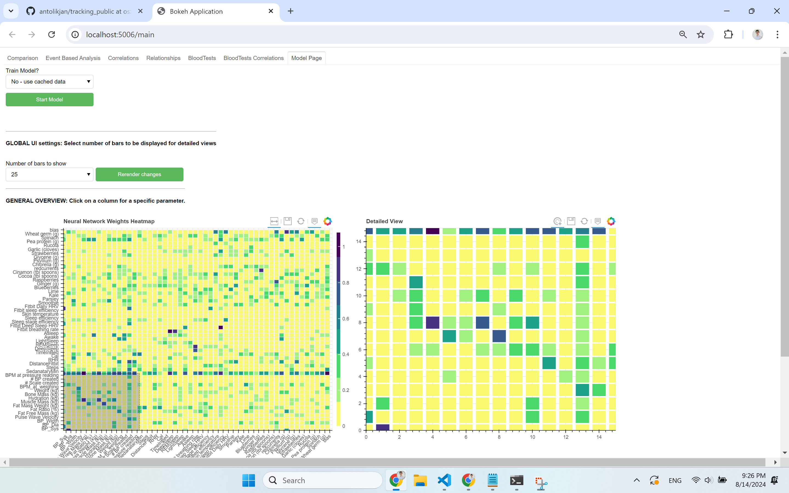
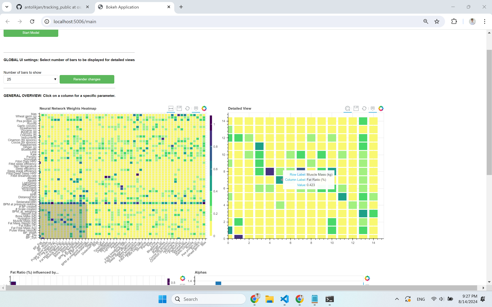
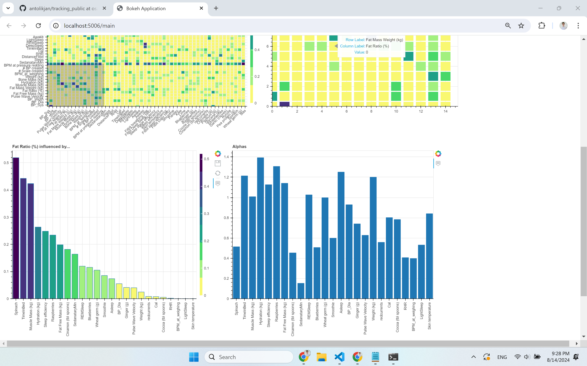
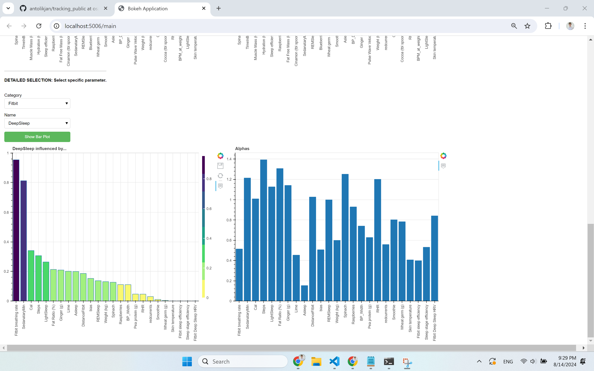
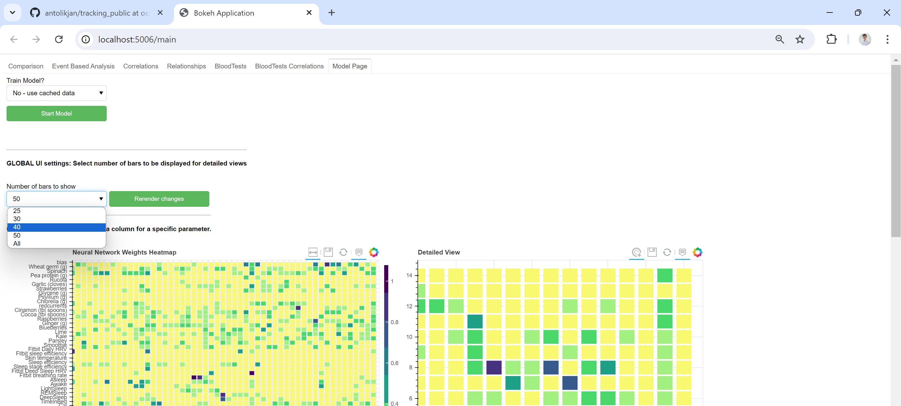
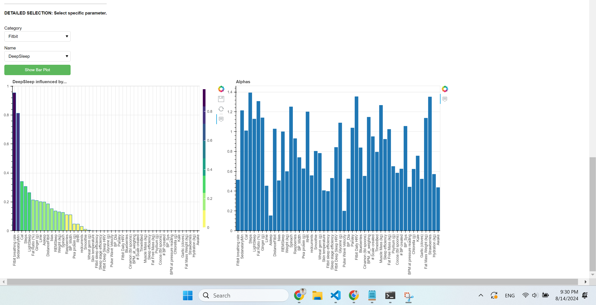

# User documentation - Quantified Self
 
**Autor:** Oszkár Urbán
**Semester:** Summer semester 2023/2024

## Úvod
Quantified Self is a scientific platform that visualizes the findings of self-recorded biomedical data. 

Consists, of several subpages, to see the part I contributed to, navigate to:
- `Model Page` - visulizes findigs of the underlying multivariable linear regression model in order to identify which parameters are influenced by which ones.

### Select data source - cached model or train model

### Heatmap of Model Weights
- drag the detailed view selection box (gray semi-transparent box), to the part of the heatmap to display the corresponding heatmap in more detail

### Detailed view of Model Weights
- hover over the detailed heatmap to find out specific values, click the column to display a new view that shows which parameters influence the hovered column

### View of bar charts "Column X predicted by" & "Alphas"

### Selection widget for specific column bar chart
- alternatively, show "Column X predicted by" by selecting the desired parameter from a selection widget

### Adjust number of bars displayed on individual bar charts

### See effected changes

